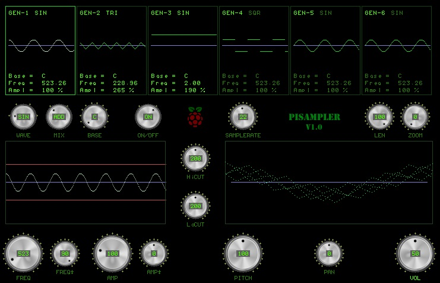
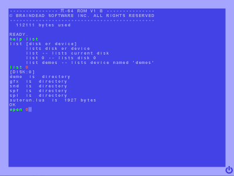
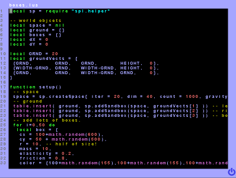
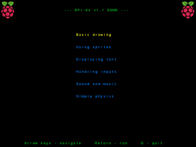
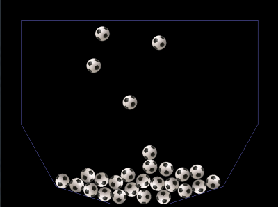
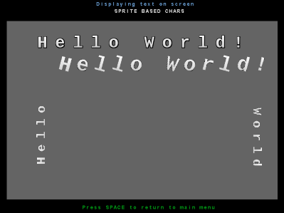
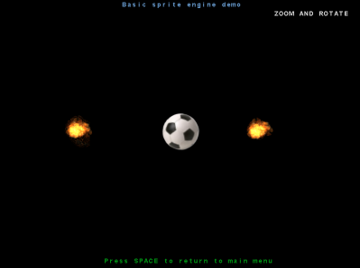
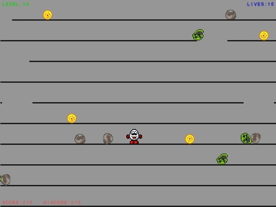

# rpi64
____________
version v1.3
============
RPI64 is not an emulator just mimics the 80's classic 8bit computers.
The program primary target is raspberry pi but it should work on various operating systems (LINUX/UNIX, WINDOWS)
PI64 has a small shell/interpreter with a C64 like fullscreen editor and a built-in program editor.
The programming language of RPI64 is the LUA programming language.
RPI64 has 'ROM' which was written also in LUA. 
This 'ROM' is responsible for the shell/interpreter and for some i/o functions.
Graphic and sound based on SDL and RtAudio libraries. Simple phisycs library based on Chipmunk.
RPI64 is open for any extensions just create or install your favourite library (.lua, .so, .dll) and use it!
RPI64 doesn't requires X on unix systems!
This project sorely based on Salvatore Sanfilippo's load81 project. (https://github.com/antirez/load81)
RPI64 written in pure c so it's easy to port to any os.

Screenshots
-----------

BINARY DOWNLOADS
================
ARM7 and Windows binary downloads at https://sourceforge.net/projects/pi64/files/binaries
	
